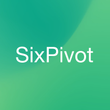

A month down already in 2024, which means it's my 3rd anniversary at SixPivot!

I'm pleased to report things continue to go well on the work front. Working for a remote-first company really does suit me. Here I sit (or sometimes stand) at my desk at home, looking out at my garden and to the hills beyond. My morning commute is (depending on the weather) a 5km walk around the neighbourhood, or if I'm feeling inspired a 20km bike ride. As long as there aren't too many meetings (which isn't that common for me) then being able to focus without distractions is very valuable.

It is also so good to have the depth and variety of expertise to draw on with my colleagues. That is a real highlight and something I lean on pretty regularly. I try to repay the favour when I can too. There's a positive shared sense of humour across the company too - I think that's also a healthy sign.

Even though we all work remotely, it is extra special when we do catch up in person. That has happened over the past 12 months, with both me travelling interstate a few times, and also when we had an impressive contingent of Pivots in town for [DDD Adelaide 2024](/2023/11/ddd-adelaide-2023-done) in November.

Another nice thing about having a work anniversary at SixPivot (aka 'workversary'!) is you are [given a bunch of 'good vibes' points to spend](https://handbook.sixpivot.com.au/perks-and-benefits/benefits#perks) in the [rewards shop](https://handbook.sixpivot.com.au/perks-and-benefits/rewards-shop).

I'm looking forward to seeing what the next 12 months at SixPivot brings.

