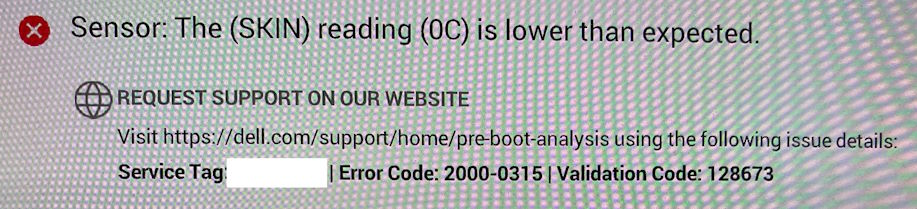
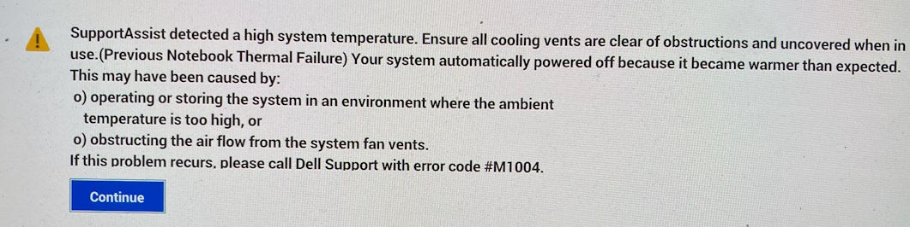
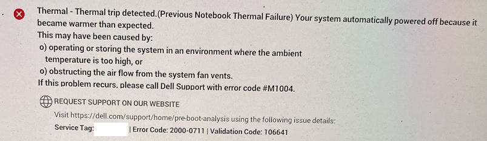
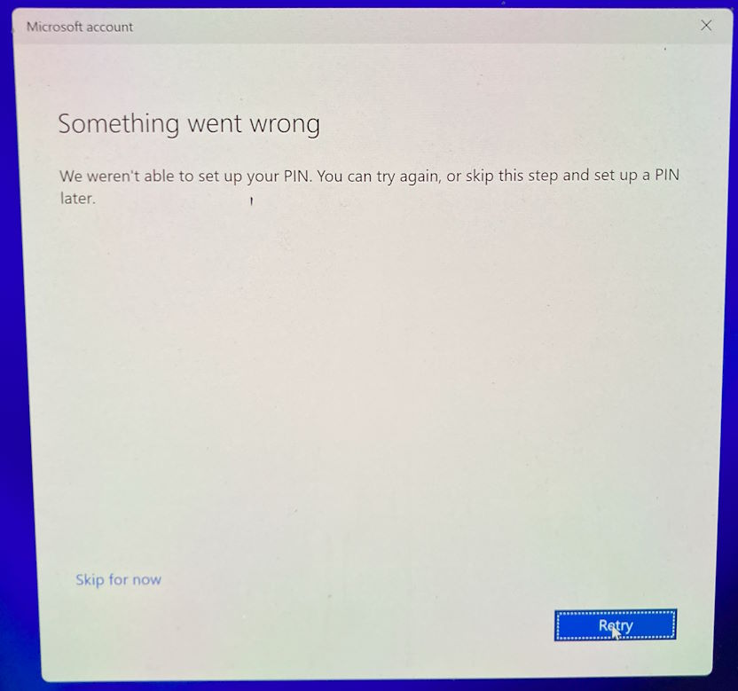

It hasn't all been smooth sailing with my [new laptop](/2023/04/new-laptop). I had some stability issues last year where it was blue screening, and when it restarted the NVidia GPU was not present in the Device Manager (or Task Manager). After a few attempts with Dell Support replacing parts, it eventually started behaving again.

Then a couple of weeks ago, I had a notification popup on my laptop. The Dell 'SupportAssist' app had noticed the fan had failed a couple of times recently. I was surprised, as I hadn't noticed any issues. I contacted Dell Support and they asked me to run the firmware-level SupportAssist diagnostic. Sure enough, it said there was an issue with a 'SKIN' sensor reading 'is lower than expected'. I'm not sure exactly what that is, but I did find a mention of the Error Code "2000-0315" on [this page](https://www.dell.com/support/kbdoc/en-au/000181167/reference-table-of-epsa-psa-error-codes-and-troubleshooting-steps-2000-0nnn-series).

The warning turned out to be accurate as within a matter of days my laptop was quickly becoming unreliable.

Dell arranged an onsite visit from a support technician, who ended up replacing fans and heat-sinks.

Frustratingly, that very evening after the repair had been completed, I was using my laptop again, and this time it spontaneously shutdown with no warning. I was surprised as it didn't even feel particularly warm. Restarting it showed the following screen, so it obviously still had a problem.

Dell organised another support visit, this time to replace the entire motherboard. When that technician arrived, he unpacked the replacement board only to discover it had been damaged. So now I'd have to wait for them to send out *another* replacement board. Initially, that was predicted to take almost two weeks (possibly they'd run out of stock in Australia?).

But then early yesterday I got an email saying the tech was coming that morning. I was a bit surprised - usually they let you know the day before and you can always reschedule the appointment if it isn't convenient. I tried to do just that but their website just shows a generic error. Later that morning the time window was coming to an end when I received another email saying they'd bumped the time to later in the day. That could be problematic as I had an appointment I needed to attend late afternoon. Fortunately, the tech rang early afternoon and was able to swap over a new motherboard with plenty of time to spare.

So hopefully we're now back to a working laptop.

Not completely smooth sailing however. When they replace the motherboard, that includes a new Trusted Platform Module (TPM) chip - so things like your Windows Hello PIN, fingerprint and Face Recognition won't work and will need to be reset. But this time around, Windows wouldn't let me. I'd sign in, confirm on my phone with the Authenticator app, and then it would fail.

I don't think there's a way around this error. Retry gave the same error and 'Skip for now' took you back to the sign-in screen.

I did happen to have a second local account on the machine, but it isn't an admin account. I could sign in successfully with that account, but not switch to my Microsoft Account. I think I'm looking at a complete reinstall. I wasn't overly worried by this as I know anything important is already synced in OneDrive. I also make use of the Synology Active Business Backup to backup all our computers at home, so I was confident I'd also have a full backup image of the machine that I could get any files from if needed.

Before paving the machine, I wisely checked the [Synology backup](/2021/04/synology-DS1621xs-review) status. I currently choose to only run the Synology on the weekends (to save power and $$), so that does also mean backups can only happen on the weekend. I was surprised to find that the last backup was from mid-January!

Pleasingly, the Synology backup agent was already present on the laptop, and I could control that from the Synology management interface to initiate a fresh backup (rather than have to wait for the next scheduled one to start). If you go to the **Task List** panel, then you can right-click on the row for the computer in question and select **Back up**.

Now with a fresh backup, I'm ready to reinstall Windows and run my [Boxstarter scripts](https://gist.github.com/flcdrg/87802af4c92527eb8a30) to install all the applications I need.

I also noticed my Synology disks are getting a bit full, so it might be time to buy another, larger hard disk to ensure I have enough space going forward.

