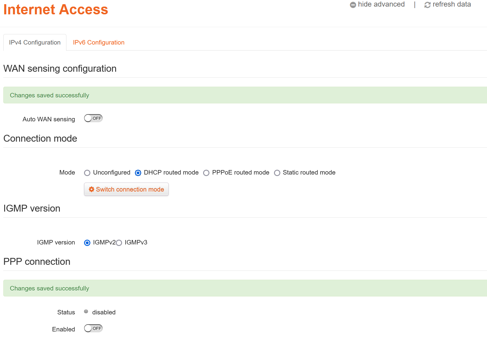
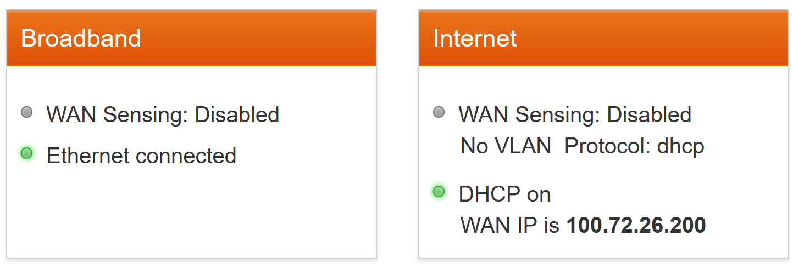

Last time I described how I'd [upgraded our home internet from Fibre to the node (FTTN) to Fibre to the premises (FTTP)](/2024/08/fttp). I've since made a minor changes to the gateway settings after getting some feedback from the folks in the [Leaptel thread](https://forums.whirlpool.net.au/thread/9062r7z9) on Whirlpool.

I had configured my gateway to use PPP to authenticate with the FTTN connection, and initially when I switched to FTTP I kept that in place. But I've since learned that there's another option to consider:

d-m-z [said](https://whrl.pl/RgKeQA):

> Looks like you're using PPPoE? You're probably better off with DHCP, as PPPoE adds extra overhead.

and went on to explain:

> PPPoE encapsulates your traffic. There's an 8-byte header on each packet. Packets can be up to 1500 bytes, but aren't always that big. So as a percentage, the overhead varies. This part isn't that big of a deal though.
>
> The other thing you can run into is the CPU required to run PPPoE. On the 100/20 plan that you have, it's probably not an issue. If you moved to a faster plan, you will likely find a bunch of routers can't do PPPoE at gigabit speeds.
>
> In your Leaptel portal, as long as IPoE is enabled (it is by default), you should simply be able to switch your router over to the DHCP mode. You might need to kick your session and/or reboot the router. And that should be it.

Matt E (Leaptel CEO) [clarified](https://whrl.pl/RgKeTi):

> There are advantages to PPPoE over DHCP. If you router handles the speeds well on PPPoE you get extra error correction as well as any network changes which force you to re-auth you are back online within a 90 seconds. But there is overhead issues as well as if your router's CPU can handle it.

So it seems there are a couple of options:

1. Stick with the PPP configuration and maybe get a bit more reliability, or
2. Switch to DHCP and lessen the overhead on your gateway and maybe get a tiny bit more throughput on your connection

I decided I'd try out the DHCP option to see what it was like:

Firstly, I turned off the **auto WAN sensing** option and disabled the **PPP connection**.

This then enabled me to select **DHCP routed mode**. Saving those changes and then reloading the **Internet Access** page then showed the DHCP connection was up:

And now the gateway's main status page showed it was in 'DHCP' mode.

Regarding DHCP - it's my impression that this essentially telling the gateway to be a DHCP client to configure itself. Not to be confused with choosing to run a DHCP server on your local network (quite often on the gateway itself), servicing devices on your network.

So far, so good!

