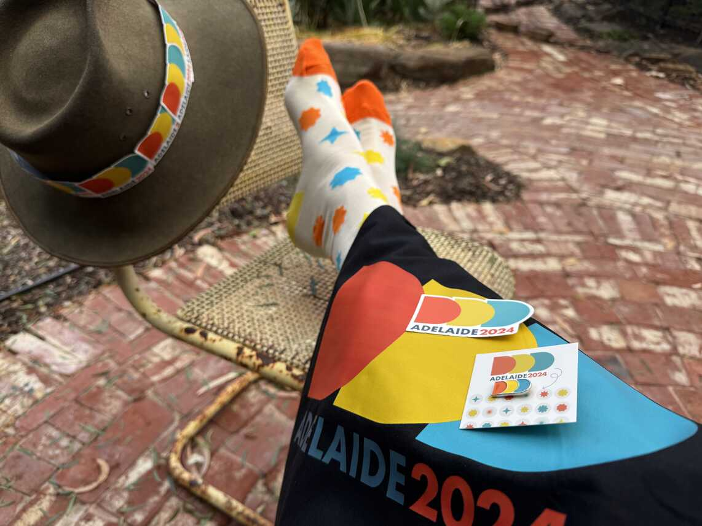
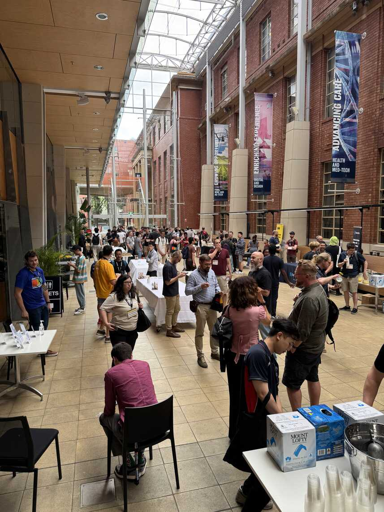
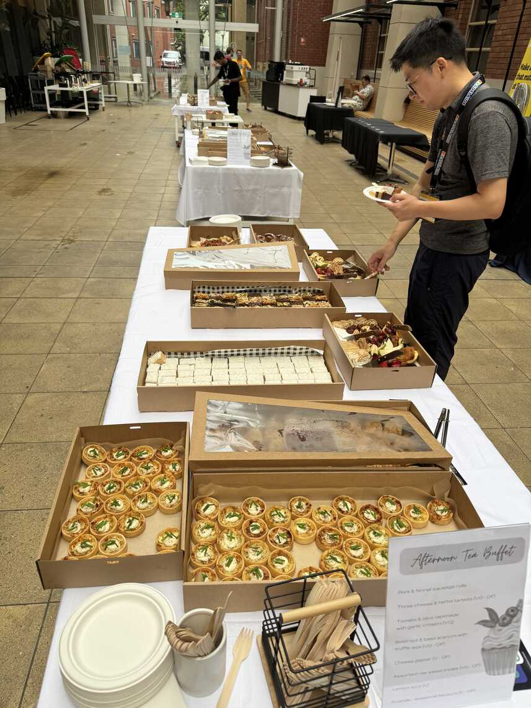
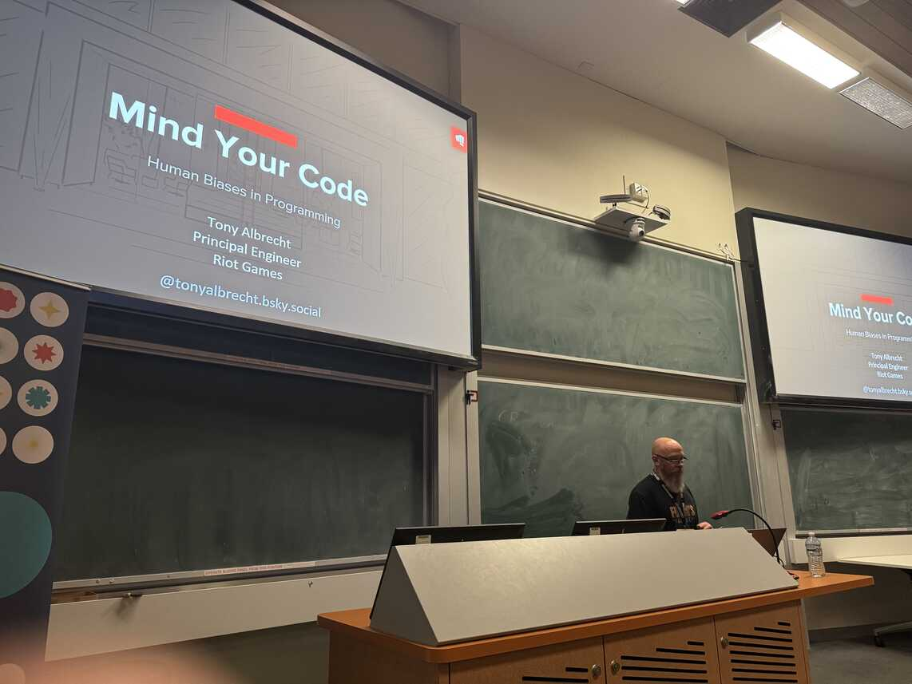

Last Saturday we ran [DDD Adelaide 2024](https://www.dddadelaide.com) - Adelaide's largest community run conference for the tech community. Around 350 software developers and folks from related disciplines gathered at the University of Adelaide for a day of great speakers, food, coffee and conversations.

This follows on from the 2023 conference, so you'd think it would be all routine now. But there were a few organisational challenges on the morning. Thankfully, most attendees would have been blissfully unaware, other than we had a last minute room change. While the new room was a little further away, we did hear back that the room itself had great atmosphere.

Again, [Cargo Catering](https://www.cargocateringco.com/) and [B3 Coffee](https://b3coffee.com.au) did an awesome job keeping everyone fed and watered throughout the day. Because we increased the size of the event we switched to 'lunch bowls' for lunch, and they worked really well (with no big queues of people waiting ages compared to last year).

By the end of the day, I was starting to finally relax and enjoy the last session (Tony Albrecht on human biases in programming - excellent!) and then wrap up the day with a bit of fun with Andrew Best, thanking all those who helped make the day happen, and the all important prize draw.

This coming weekend I'll be attending our sister event [DDD Brisbane](https://www.dddbrisbane.com/) for the first time. I'll be giving my [10 tips and tricks for GitHub Actions and Azure DevOps](https://sessionize.com/s/DavidGardiner/10-tips-and-tricks-for-github-actions-and-azure-de/112069) talk, and also helping out on the day as a volunteer. I'm really looking forward to catching up with friends and colleagues, as well as observing how Brisbane run their event. Maybe I'll see you there?
