Well this was an early Christmas present. I had submitted a talk for [DDD Brisbane](https://www.dddbrisbane.com) earlier this year, and it got voted in! So my work ([SixPivot](https://www.sixpivot.com.au)) kindly flew me up to Brisbane for the weekend. I'd never been to DDD Brisbane before, so I was really looking forward to being there.

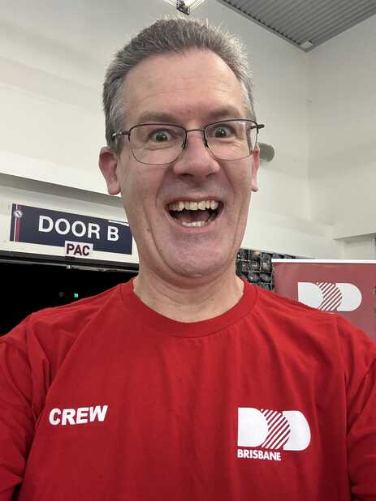

It was only [two weeks ago](/2024/11/ddd-adelaide-2024.html) that we ran [DDD Adelaide](https://www.dddadelaide.com), but it's quite a different experience being an organiser compared to just being an attendee. [Chris Gilbert](https://www.linkedin.com/in/chriswithpants) (one of the DDD Brisbane organisers) also works at SixPivot so when I knew I'd be going I mentioned to him I'd be happy to help out on the day. So as well as speaking I was also a DDD Brisbane volunteer (complete with a bright red t-shirt!). It was a great way to support the event, as well as giving me an inside perspective on how the Brisbane team do DDD and hopefully be able to bring home some new ideas for Adelaide.

I stayed at the [Vine Apartments](https://www.vineapartments.com.au/), which is conveniently a short walk from Brisbane State High School (where DDD Brisbane is held). Just before 7am Saturday morning, [Bronwen Zande](https://soulsolutions.com.au/) (the other DDD Brisbane 2024 organiser) and John O'Brien (who was also the DDD Brisbane photographer) picked me up on their way through, and we began setting up.

 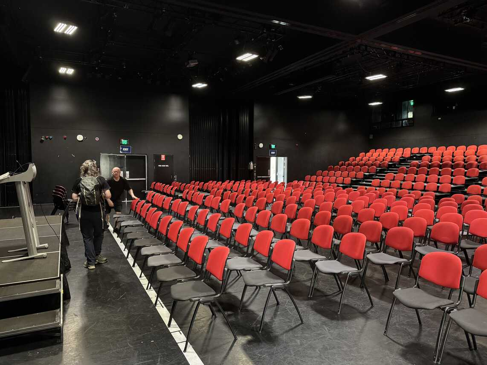

A bunch of other volunteers quickly appeared and a very organised preparation began. They have obviously done this before as they knew what needed to be done, and what needed to go where.

 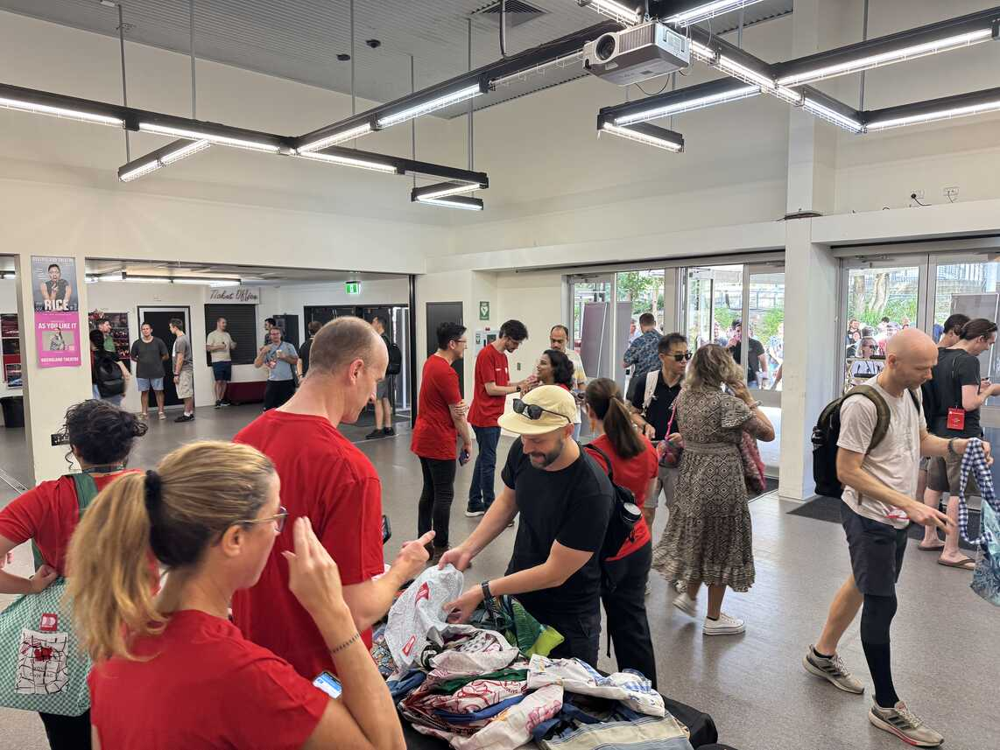

Around 8am registrations began. It's a similar process to Adelaide, with attendees being 'checked in' via an app, and then given lanyards and really nifty bags (made by [Boomerang Bags](https://boomerangbags.org/)).

The keynote speaker was [Joel Pobar](https://www.linkedin.com/in/joelpob/). I remember seeing him speak at a few Microsoft TechEd conferences [many years ago](/2005/11/microsoft-sydney-launch-party-part-2.html), so it was interesting to hear what he's been up to since those days. He now works for [Anthropic](https://www.anthropic.com/), and his talk on AI was a) pretty deep, with a few maths equations that were a bit over my head and b) left me feeling a bit uneasy about the future as he shared his own concerns about where things might be heading. A personal quibble, I would have preferred he kept his language G rated. That was a distraction I didn't think was necessary.

Then I was off to act as host for the 'PAC 2' session room (they ran 4 breakout sessions in parallel for most of the day).

I heard Daniel Fang present "LEGO + Python + GPT = The Journey from Dad to Superdad with OpenAI and Robotics!"

 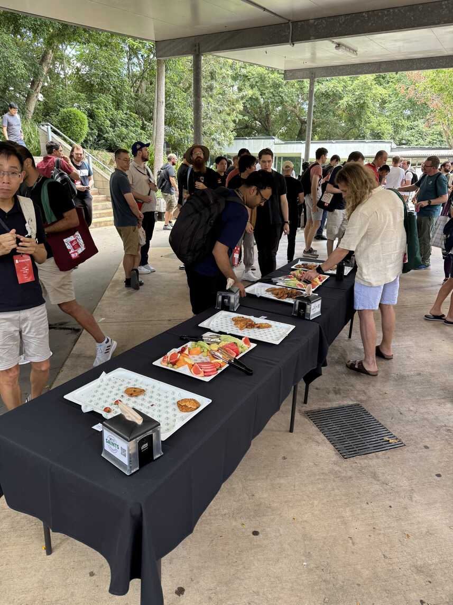

A short break for morning tea with fresh fruit and some nice biscuits.

Then Jason Taylor with "Practical Clean Architecture with ASP.NET Core 9". I hope we can get Jason down to Adelaide to speak at [Adelaide .NET User Group](https://www.adnug.net) sometime.

Followed by Stephen Rees-Carter with "Th1nk Lik3 a H4cker". This was really interesting hands-on session with the audience invited to try and hack along with Stephen.

 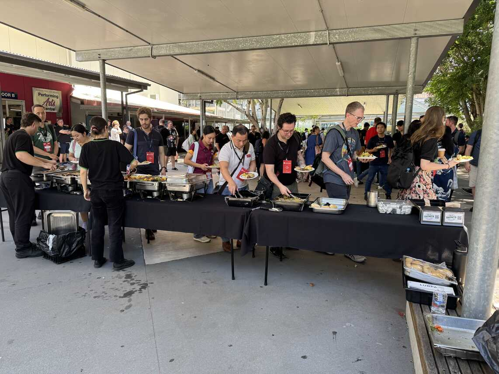

Lunch was served outside. Roast beef, chicken, and hot vegetables - yum.

I handed over my room hosting duties for PAC 2 to my SixPivot colleague Dylan (who was also volunteering for the day), so I was now free to check out some sessions in different rooms for the afternoon (apart from when it was time for me to present back in PAC 2).

I caught a bit of Bryden Oliver & Luke Parker presenting "Feel the Mayhem - When Deployments go Wrong". This was less about the technical details of failed deployments (which I've previously done talks on myself) and more about the "people and process" part of recovering from an incident.

I left a few minutes early (to get back to the PAC 2 room to start preparing for my presentation) and caught the end of Aaron Powell's "I've burnt out, now what".

Then it was my turn to present "10 tips and tricks for GitHub Actions and Azure DevOps".

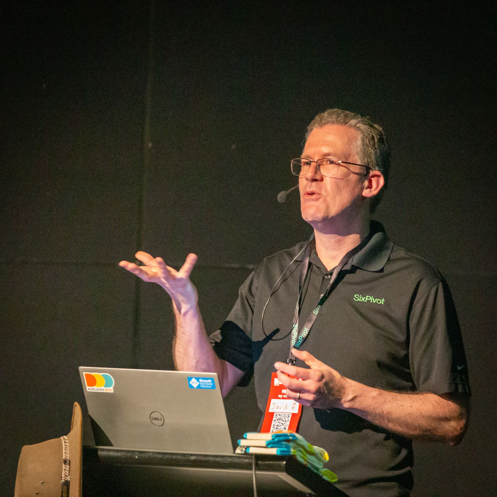

I'd previously presented this talk at Adelaide .NET User Group a few months ago and it went over an hour. I knew I only had 45 minutes at DDD, so when I did a test run for my work colleagues earlier this week I tried to tighten it up, but over compensated by finishing it in about 25 minutes! A few more practice runs helped to find the middle ground, such that on the day I finished right about the 40 minute mark, giving 5 minutes for a few questions at the end. I also was able to give out a couple of pairs of DDD Adelaide socks.

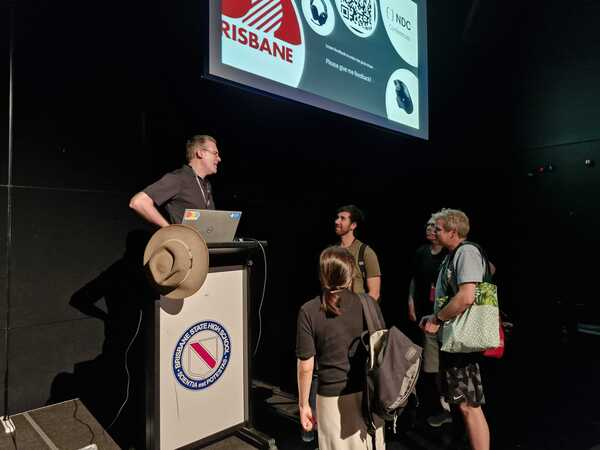

After a spot of afternoon tea (actually I was chatting to people so much it was all gone by the time I realised!), it was off the last session of the day - Joe Patterson with "Simplicity Driven Design".

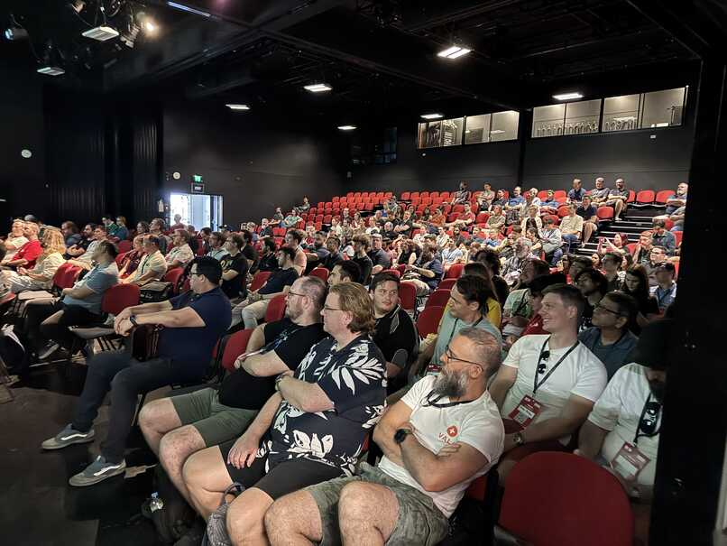

DDD Brisbane have a locknote to finish off the day. This year it was [Dr Jenine Beekhuyzen OAM](https://www.jeninebeekhuyzen.com). I have not met her before, but I do have an interesting connection. A number of years ago Bronwen Zande was promoting the [Tech Girls are Superheroes](https://www.amazon.com.au/Tech-Girls-Superheroes-Jenine-Beekhuyzen-ebook/dp/B07MJ6QTR9?&linkCode=ll1&tag=flcdrg07-22&linkId=7217e1eb2c0c05b458eec0cb87d16cc9&language=en_AU&ref_=as_li_ss_tl) books (written by Dr Beekhuyzen) on Twitter and I was able to get a copy for my eldest daughter.

 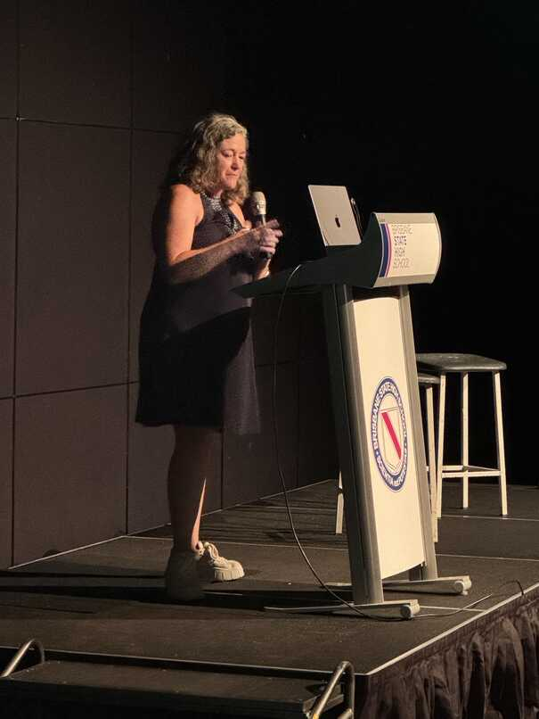

Sometime later, I'd arranged for Bronwen to speak to the Adelaide .NET User Group and while she was visiting I also arranged for her to visit the high school my kids attended and she gave a talk about her experience as a software developer (and more excitingly for the students) working with Microsoft's HoloLens.

So now it was great to hear Dr Beekhuyzen in person. Bronwen had asked me a few weeks ago if I might ask my daughter if she had any thoughts on the impact reading the book and having relevant role models might have had.

Near the end of Jenine's talk, Bronwen invited me up on stage to share her thoughts. I was able to thank both Jenine and Bronwen for their positive influence and read out the following quote from my daughter:

> It was encouraging to read stories about women in tech at a young age when I was making decisions about what I wanted to do in the future

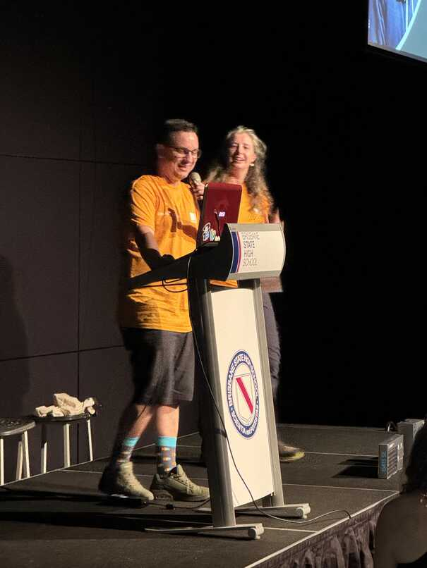

After the prize draw (which cleverly required that you had submitted feedback at least once to be eligible to win, as well as be present in the room), there were thank yous and a closing farewell, and also an intriguing hint of a possible 'DDD Outback 2025' satellite event.

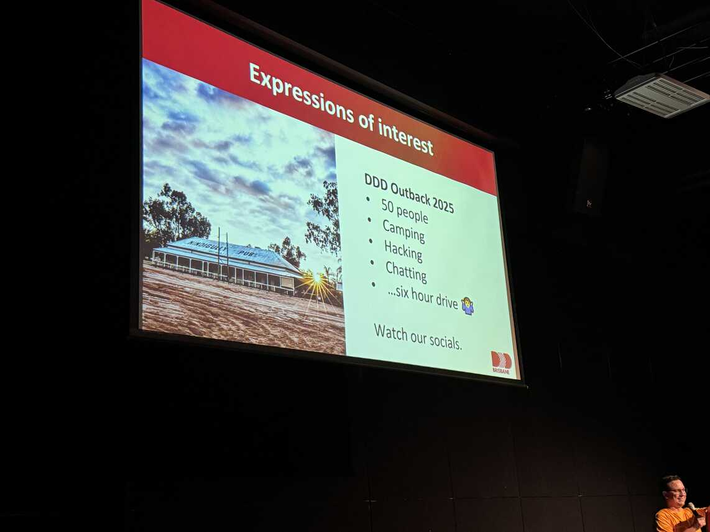

Then it was time to pack down (which again didn't take too long with the volunteers all pitching in), and a final farewell to my DDD Brisbane friends.

It was such a privilege to be able to attend and I can't thank enough the organisers, volunteers and also the sponsors for all they've done to put on another successful event. I hope I get an opportunity to visit again in the future.

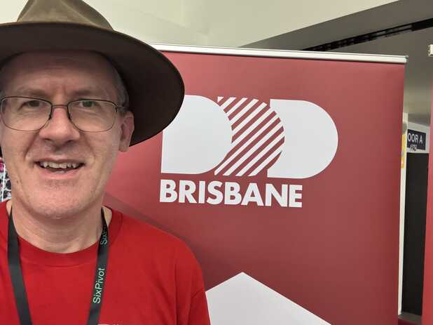

* [OAM]: Medal of the Order of Australia
