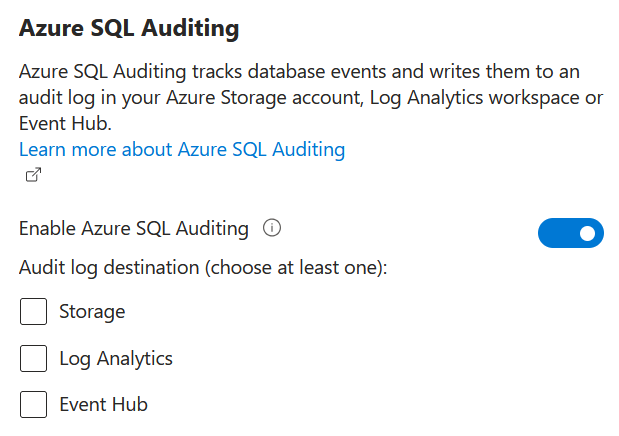
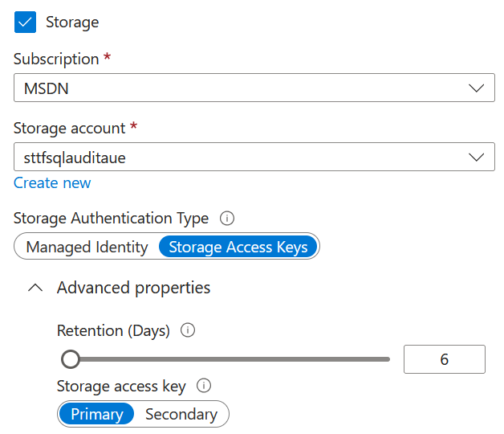
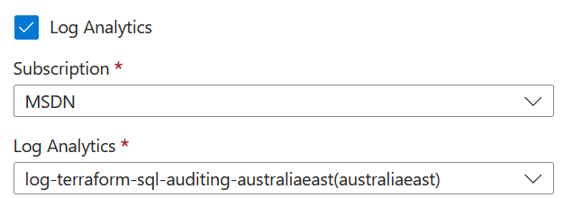
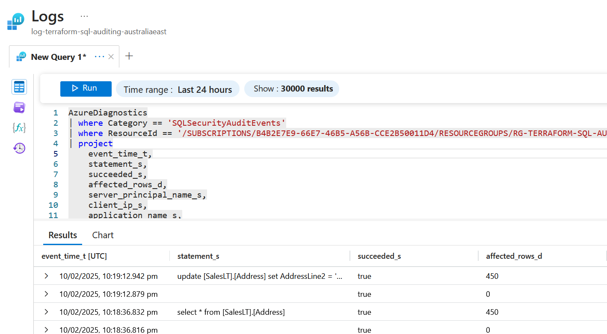
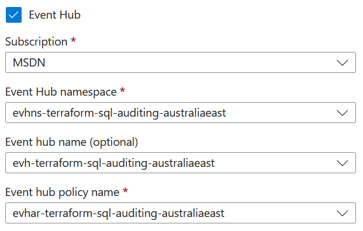

Sometimes when you're using Terraform for your Infrastructure as Code with Azure, it's a bit tricky to match up what you can see in the Azure Portal versus the Terraform resources in the AzureRM provider. Enabling auditing in Azure SQL is a great example.



In the Azure Portal, select your Azure SQL resource, then expand the **Security** menu and select **Auditing**. You can then choose to **Enable Azure SQL Auditing**, and upon doing this you can then choose to send auditing data to any or all of Azure Storage, Log Analytics and/or Event Hub.

It's also worth highlighting that usually you'd [enable auditing at the server level](https://learn.microsoft.com/azure/azure-sql/database/auditing-server-level-database-level?view=azuresql&WT.mc_id=DOP-MVP-5001655), but it is also possible to enable it per database.

The two Terraform resources you may have encountered to manage this are [`mssql_server_extended_auditing_policy`](https://registry.terraform.io/providers/hashicorp/azurerm/latest/docs/resources/mssql_server_extended_auditing_policy) and [`mssql_database_extended_auditing_policy`](https://registry.terraform.io/providers/hashicorp/azurerm/latest/docs/resources/mssql_database_extended_auditing_policy).

It's useful to refer back to the [Azure SQL documentation on setting up auditing](https://learn.microsoft.com/en-us/azure/azure-sql/database/auditing-setup?view=azuresql&WT.mc_id=DOP-MVP-5001655) to understand how to use these.

A couple of points that are worth highlighting:

1. If you don't use the `audit_actions_and_groups` property, the default groups of actions that will be audited are:

    BATCH_COMPLETED_GROUP
    SUCCESSFUL_DATABASE_AUTHENTICATION_GROUP
    FAILED_DATABASE_AUTHENTICATION_GROUP

2. If you do define auditing at the server level, the policy applies to all existing and newly created databases on the server. If you define auditing at the database level, the policy will apply in addition to any server level settings. So be careful you don't end up auditing the same thing twice unintentionally!

Sometimes it can also be useful to review equivalent the Bicep/ARM definitions [Microsoft.Sql/servers/extendedAuditingSettings](https://learn.microsoft.com/en-us/azure/templates/microsoft.sql/servers/extendedauditingsettings?pivots=deployment-language-bicep&WT.mc_id=DOP-MVP-5001655), as sometimes they can clarify how to use various properties.

You'll see both the Terraform and Bicep have properties to configure using a Storage Account, but while you can see Log Analytics and Event Hub in the Portal UI, it's not obvious how those set up.

The simplest policy you can set is this:

```hcl
resource "azurerm_mssql_server_extended_auditing_policy" "auditing" {
  server_id = azurerm_mssql_server.mssql.id
}
```

This enables the server auditing policy, but the data isn't going anywhere yet!

### Storage account

When you select an Azure Storage Account for storing auditing data, you will end up with a bunch `.xel` files created under a **sqldbauditlogs** blob container.

There are a number of ways to view the `.xel` files, [documented here](https://learn.microsoft.com/en-us/azure/azure-sql/database/auditing-analyze-audit-logs?view=azuresql&WT.mc_id=DOP-MVP-5001655#analyze-logs-using-logs-in-an-azure-storage-account)

Using a storage account for storing auditing has a few variations, depending on how you want to authenticate to the Storage Account.

#### Access key

```hcl
resource "azurerm_mssql_server_extended_auditing_policy" "auditing" {
  server_id = azurerm_mssql_server.mssql.id

  storage_endpoint                        = azurerm_storage_account.storage.primary_blob_endpoint
  storage_account_access_key              = azurerm_storage_account.storage.primary_access_key
  storage_account_access_key_is_secondary = false
  retention_in_days                       = 6
}
```

Normally `storage_account_access_key_is_secondary` would be set to `false`, but if you are rotating your storage access keys, then you may choose to switch to the secondary key while you're rotating the primary.



#### Managed identity

You can also use managed identity to authenticate to the storage account. In this case you don't supply the access_key properties, but you will need to add a role assignment granting the **Storage Blob Data Contributor** role to the identity of your Azure SQL resource.

```hcl
resource "azurerm_mssql_server_extended_auditing_policy" "auditing" {
  server_id = azurerm_mssql_server.mssql.id

  storage_endpoint  = azurerm_storage_account.storage.primary_blob_endpoint
  retention_in_days = 6
}
```

### Log analytics workspaces

To send data to a Log Analytics Workspace, the `log_monitoring_enabled` property needs to be set to `true`. This is the default.

But to tell it *which* workspace to send the data to, you need to add a [`azurerm_monitor_diagnostic_setting`](https://registry.terraform.io/providers/hashicorp/azurerm/latest/docs/resources/monitor_diagnostic_setting) resource.

```hcl
resource "azurerm_monitor_diagnostic_setting" "mssql_server_to_log_analytics" {
  name                       = "example-diagnostic-setting"
  target_resource_id         = "${azurerm_mssql_server.mssql.id}/databases/master"
  log_analytics_workspace_id = azurerm_log_analytics_workspace.la.id

  enabled_log {
    category = "SQLSecurityAuditEvents"
  }
}
```



Note that for the server policy, you set the `target_resource_id` to the master database of the server, not the resource id of the server itself.

Here's what the auditing data looks like when viewed in Log Analytics:



### Event Hub

Likewise, if you want data to go to an Event Hub, you need to use the `azurerm_monitor_diagnostic_setting` resource.

```hcl
resource "azurerm_monitor_diagnostic_setting" "mssql_server_to_event_hub" {
  name                           = "ds_mssql_event_hub"
  target_resource_id             = "${azurerm_mssql_server.mssql.id}/databases/master"
  eventhub_authorization_rule_id = azurerm_eventhub_namespace_authorization_rule.eh.id
  eventhub_name                  = azurerm_eventhub.eh.name

  enabled_log {
    category = "SQLSecurityAuditEvents"
  }
}
```



### Multiple destinations

As is implied by the Azure Portal, you can have one, two or all three destinations enabled for auditing. But it isn't immediately obvious that you should only have one `azurerm_monitor_diagnostic_setting` for your server auditing - don't create separate `azurerm_monitor_diagnostic_setting` resources for each destination - Azure will not allow it.

For example, if you're going to log to all three, you'd have a single diagnostic resource like this:

```hcl
resource "azurerm_monitor_diagnostic_setting" "mssql_server" {
  name                           = "diagnostic_setting"
  target_resource_id             = "${azurerm_mssql_server.mssql.id}/databases/master"
  eventhub_authorization_rule_id = azurerm_eventhub_namespace_authorization_rule.eh.id
  eventhub_name                  = azurerm_eventhub.eh.name

  log_analytics_workspace_id     = azurerm_log_analytics_workspace.la.id
  log_analytics_destination_type = "Dedicated"

  enabled_log {
    category = "SQLSecurityAuditEvents"
  }
```

Note, this Terraform resource does have a `storage_account_id` property, but this doesn't seem to be necessary as storage is configured via the `azurerm_mssql_server_extended_auditing_policy` resource.

You would need separate `azurerm_monitor_diagnostic_setting` resources if you were configuring auditing per database though.

## Common problems

### The diagnostic setting can't find the master database

Error: creating Monitor Diagnostics Setting "diagnostic_setting" for Resource "/subscriptions/00000000-0000-0000-0000-000000000000/resourceGroups/rg-terraform-sql-auditing-australiaeast/providers/Microsoft.Sql/servers/sql-terraform-sql-auditing-australiaeast/databases/master": unexpected status 404 (404 Not Found) with error: ResourceNotFound: The Resource 'Microsoft.Sql/servers/sql-terraform-sql-auditing-australiaeast/databases/master' under resource group 'rg-terraform-sql-auditing-australiaeast' was not found. For more details please go to https://aka.ms/ARMResourceNotFoundFix

It appears that [sometimes the `azurerm_mssql_server` resource reports it is created, but the master database is not yet ready](https://github.com/hashicorp/terraform-provider-azurerm/issues/22226
). The workaround is to add a dependency on another database resource - as by definition the master database must exist before any other user databases can be created.

### Diagnostic setting fails to update with 409 Conflict

[This error seems to happen to me when I try and set up Storage, Event Hubs and Log Analytics at the same time](https://github.com/hashicorp/terraform-provider-azurerm/issues/21161).

Error: creating Monitor Diagnostics Setting "diagnostic_setting" for Resource "/subscriptions/00000000-0000-0000-0000-000000000000/resourceGroups/rg-terraform-sql-auditing-australiaeast/providers/Microsoft.Sql/servers/sql-terraform-sql-auditing-australiaeast/databases/master": unexpected status 409 (409 Conflict) with response: {"code":"Conflict","message":"Data sink '/subscriptions/00000000-0000-0000-0000-000000000000/resourceGroups/rg-terraform-sql-auditing-australiaeast/providers/Microsoft.EventHub/namespaces/evhns-terraform-sql-auditing-australiaeast/authorizationRules/evhar-terraform-sql-auditing-australiaeast' is already used in diagnostic setting 'SQLSecurityAuditEvents_3d229c42-c7e7-4c97-9a99-ec0d0d8b86c1' for category 'SQLSecurityAuditEvents'. Data sinks can't be reused in different settings on the same category for the same resource."}

After a lot of trial and error, I've found the solution is to add a `depends_on` block in your `azurerm_mssql_server_extended_auditing_policy` resource, so that the `azurerm_monitor_diagnostic_setting` is created first. (This feels like a bug in the Terraform AzureRM provider)

```hcl
resource "azurerm_mssql_server_extended_auditing_policy" "auditing" {
  server_id = azurerm_mssql_server.mssql.id

  storage_endpoint  = azurerm_storage_account.storage.primary_blob_endpoint
  retention_in_days = 6

  depends_on = [azurerm_monitor_diagnostic_setting.mssql_server]
}
```

### Switching from Storage access keys to managed identity has no effect

Removing the storage access key properties from `azurerm_mssql_server_extended_auditing_policy` doesn't currently switch the authentication to managed identity. The problem may relate to the `storage_account_subscription_id` property. This is an optional property and while you usually don't need to set it if the storage account is in the same subscription, it appears that the AzureRM provider is setting it on your behalf, such that when you remove the other access key properties it doesn't know to set this property to null.

If you know ahead of time that you'll be transitioning from access keys to managed identity, it might be worth setting `storage_account_subscription_id` first. Then later on, when you remove that and the other access_key properties maybe Terraform will do the right thing?

### Solution resource

If you ever hit the **Save** button on the Azure SQL **Auditing** page, you may end up with a Solution resource being created for your auditing. This is useful, though it can cause problems if you are trying to destroy your Terraform resources, as it can put locks on the resources and Terraform doesn't know to destroy the solution resource first.

You could try to pre-emptively create the solution resource in Terraform. For example:

```hcl
resource "azurerm_log_analytics_solution" "example" {
  solution_name         = "SQLAuditing"
  location              = data.azurerm_resource_group.rg.location
  resource_group_name   = data.azurerm_resource_group.rg.name
  workspace_resource_id = azurerm_log_analytics_workspace.la.id
  workspace_name        = azurerm_log_analytics_workspace.la.name

  plan {
    publisher = "Microsoft"
    product   = "SQLAuditing"
  }

  depends_on = [azurerm_monitor_diagnostic_setting.mssql_server]
}
```

Though it seems that when you use Terraform to create this resource, it names it `SQLAuditing(log-terraform-sql-auditing-australiaeast)`, whereas if you use the portal, it is named `SQLAuditing[log-terraform-sql-auditing-australiaeast]`.

So instead this looks like a good use for the AzApi provider and the [`azapi_resource`](https://registry.terraform.io/providers/Azure/azapi/latest/docs/resources/resource)

```hcl
resource "azapi_resource" "symbolicname" {
  type      = "Microsoft.OperationsManagement/solutions@2015-11-01-preview"
  name      = "SQLAuditing[${azurerm_log_analytics_workspace.la.name}]"
  location  = data.azurerm_resource_group.rg.location
  parent_id = data.azurerm_resource_group.rg.id

  tags = {}
  body = {
    plan = {
      name          = "SQLAuditing[${azurerm_log_analytics_workspace.la.name}]"
      product       = "SQLAuditing"
      promotionCode = ""
      publisher     = "Microsoft"
    }
    properties = {
      containedResources = [
        "${azurerm_log_analytics_workspace.la.id}/views/SQLSecurityInsights",
        "${azurerm_log_analytics_workspace.la.id}/views/SQLAccessToSensitiveData"
      ]
      referencedResources = []
      workspaceResourceId = azurerm_log_analytics_workspace.la.id
    }
  }
}
```

## Other troubleshooting tips

The Azure CLI can also be useful in checking what the current state of audit configuration is.

Here's two examples showing auditing configured for all three destinations:

```bash
az monitor diagnostic-settings list --resource /subscriptions/00000000-0000-0000-0000-000000000000/resourceGroups/rg-terraform-sql-auditing-australiaeast/providers/Microsoft.Sql/servers/sql-terraform-sql-auditing-australiaeast/databases/master
```

gives the following:

```json
[
  {
    "eventHubAuthorizationRuleId": "/subscriptions/00000000-0000-0000-0000-000000000000/resourceGroups/rg-terraform-sql-auditing-australiaeast/providers/Microsoft.EventHub/namespaces/evhns-terraform-sql-auditing-australiaeast/authorizationRules/evhar-terraform-sql-auditing-australiaeast",
    "eventHubName": "evh-terraform-sql-auditing-australiaeast",
    "id": "/subscriptions/00000000-0000-0000-0000-000000000000/resourcegroups/rg-terraform-sql-auditing-australiaeast/providers/microsoft.sql/servers/sql-terraform-sql-auditing-australiaeast/databases/master/providers/microsoft.insights/diagnosticSettings/diagnostic_setting",
    "logs": [
      {
        "category": "SQLSecurityAuditEvents",
        "enabled": true,
        "retentionPolicy": {
          "days": 0,
          "enabled": false
        }
      },
      {
        "category": "SQLInsights",
        "enabled": false,
        "retentionPolicy": {
          "days": 0,
          "enabled": false
        }
      },
      {
        "category": "AutomaticTuning",
        "enabled": false,
        "retentionPolicy": {
          "days": 0,
          "enabled": false
        }
      },
      {
        "category": "QueryStoreRuntimeStatistics",
        "enabled": false,
        "retentionPolicy": {
          "days": 0,
          "enabled": false
        }
      },
      {
        "category": "QueryStoreWaitStatistics",
        "enabled": false,
        "retentionPolicy": {
          "days": 0,
          "enabled": false
        }
      },
      {
        "category": "Errors",
        "enabled": false,
        "retentionPolicy": {
          "days": 0,
          "enabled": false
        }
      },
      {
        "category": "DatabaseWaitStatistics",
        "enabled": false,
        "retentionPolicy": {
          "days": 0,
          "enabled": false
        }
      },
      {
        "category": "Timeouts",
        "enabled": false,
        "retentionPolicy": {
          "days": 0,
          "enabled": false
        }
      },
      {
        "category": "Blocks",
        "enabled": false,
        "retentionPolicy": {
          "days": 0,
          "enabled": false
        }
      },
      {
        "category": "Deadlocks",
        "enabled": false,
        "retentionPolicy": {
          "days": 0,
          "enabled": false
        }
      },
      {
        "category": "DevOpsOperationsAudit",
        "enabled": false,
        "retentionPolicy": {
          "days": 0,
          "enabled": false
        }
      }
    ],
    "metrics": [
      {
        "category": "Basic",
        "enabled": false,
        "retentionPolicy": {
          "days": 0,
          "enabled": false
        }
      },
      {
        "category": "InstanceAndAppAdvanced",
        "enabled": false,
        "retentionPolicy": {
          "days": 0,
          "enabled": false
        }
      },
      {
        "category": "WorkloadManagement",
        "enabled": false,
        "retentionPolicy": {
          "days": 0,
          "enabled": false
        }
      }
    ],
    "name": "diagnostic_setting",
    "resourceGroup": "rg-terraform-sql-auditing-australiaeast",
    "type": "Microsoft.Insights/diagnosticSettings",
    "workspaceId": "/subscriptions/00000000-0000-0000-0000-000000000000/resourceGroups/rg-terraform-sql-auditing-australiaeast/providers/Microsoft.OperationalInsights/workspaces/log-terraform-sql-auditing-australiaeast"
  }
]
```

And the Azure SQL audit policy

```bash
az sql server audit-policy show -g rg-terraform-sql-auditing-australiaeast -n sql-terraform-sql-auditing-australiaeast
```

Gives

```json
{
  "auditActionsAndGroups": [
    "SUCCESSFUL_DATABASE_AUTHENTICATION_GROUP",
    "FAILED_DATABASE_AUTHENTICATION_GROUP",
    "BATCH_COMPLETED_GROUP"
  ],
  "blobStorageTargetState": "Enabled",
  "eventHubAuthorizationRuleId": "/subscriptions/00000000-0000-0000-0000-000000000000/resourceGroups/rg-terraform-sql-auditing-australiaeast/providers/Microsoft.EventHub/namespaces/evhns-terraform-sql-auditing-australiaeast/authorizationRules/evhar-terraform-sql-auditing-australiaeast",
  "eventHubName": "evh-terraform-sql-auditing-australiaeast",
  "eventHubTargetState": "Enabled",
  "id": "/subscriptions/00000000-0000-0000-0000-000000000000/resourceGroups/rg-terraform-sql-auditing-australiaeast/providers/Microsoft.Sql/servers/sql-terraform-sql-auditing-australiaeast/auditingSettings/Default",
  "isAzureMonitorTargetEnabled": true,
  "isDevopsAuditEnabled": null,
  "isManagedIdentityInUse": true,
  "isStorageSecondaryKeyInUse": null,
  "logAnalyticsTargetState": "Enabled",
  "logAnalyticsWorkspaceResourceId": "/subscriptions/00000000-0000-0000-0000-000000000000/resourceGroups/rg-terraform-sql-auditing-australiaeast/providers/Microsoft.OperationalInsights/workspaces/log-terraform-sql-auditing-australiaeast",
  "name": "Default",
  "queueDelayMs": null,
  "resourceGroup": "rg-terraform-sql-auditing-australiaeast",
  "retentionDays": 6,
  "state": "Enabled",
  "storageAccountAccessKey": null,
  "storageAccountSubscriptionId": "00000000-0000-0000-0000-000000000000",
  "storageEndpoint": "https://sttfsqlauditauew0o.blob.core.windows.net/",
  "type": "Microsoft.Sql/servers/auditingSettings"
}
```
