I last attended [DDD Melbourne](https://www.dddmelbourne.com) 9 years ago, [back in 2016](/2016/08/ddd-melbourne-2016.html). In the intervening time, it has grown roughly twice the size and shifted from a uni campus to the Melbourne Town Hall. As such, I was really pleased to be able to combine a work trip to Melbourne with being able to attend DDD Melbourne 2025 this last Saturday.

It was actually seeing what Melbourne had achieved back in 2015/2016 that inspired me to want to reboot DDD in Adelaide, and a few years later we did that with DDD Adelaide. Ironically, I learned a while ago that the original CodeCampSA/DDD Adelaide events were actually the inspiration for some of the other states to run their own events (figuring if Adelaide could do it, then they should too!). Now the inspiration flows back the other way😀

For the first time in quite a while I was not speaking or volunteering, so this was a real chance just to enjoy the day, learn some new things, meet a bunch of people, and maybe pick up some ideas to take back to DDD Adelaide.

The day kicked off with a keynote from [Dr Sue Keay](https://www.suekeay.com/), who is Founder and Chair of Robotics Australia Group and an Adjunct Professor at QUT Centre for Robotics (to name just a couple of her roles). She gave a thought provoking talk about how robots are being used today and what the future might hold.

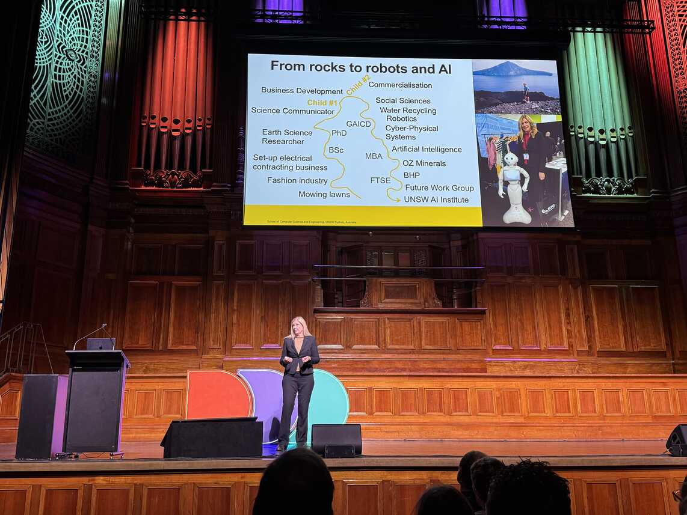

After morning tea..
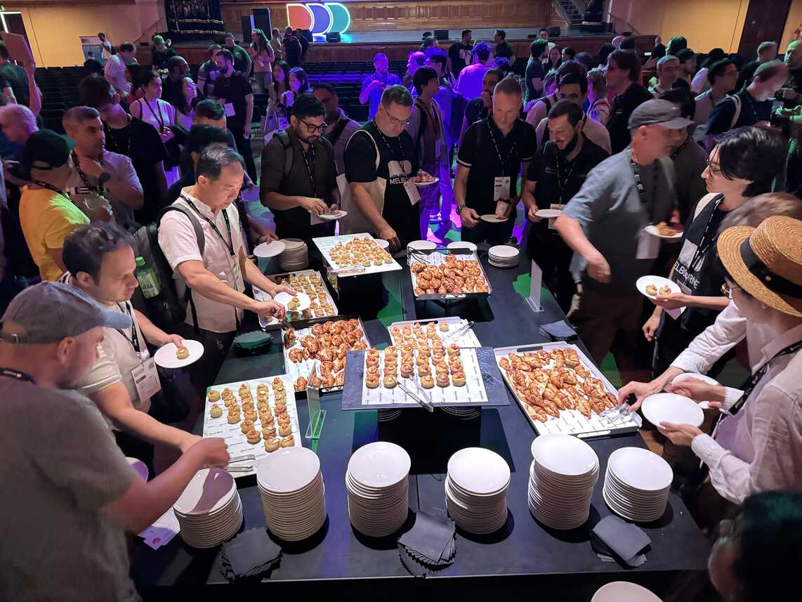

I caught [Tracy Bongiorno](https://www.linkedin.com/in/trmpowell/) presenting "Beyond Continuous Delivery - Our journey from Gitflow to Continuous Deployment"

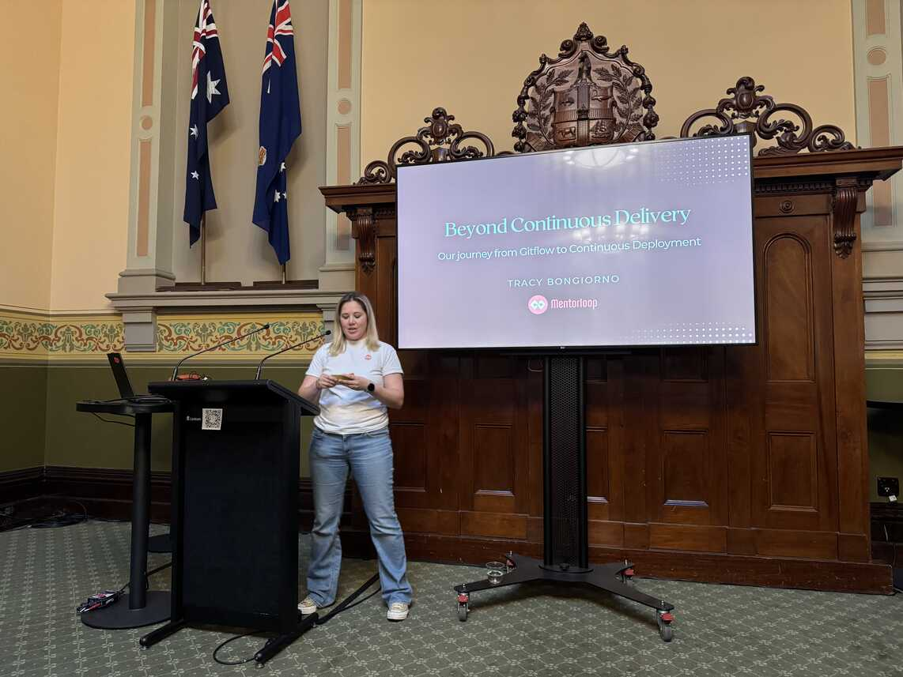

Then saw [Bryden Oliver's](https://www.linkedin.com/in/brydenoliver/) "Top Database Performance Techniques". There were a couple of his tips that seemed a bit unusual to me. It would have been good if he'd pulled up some query plans to show what was going on for those.

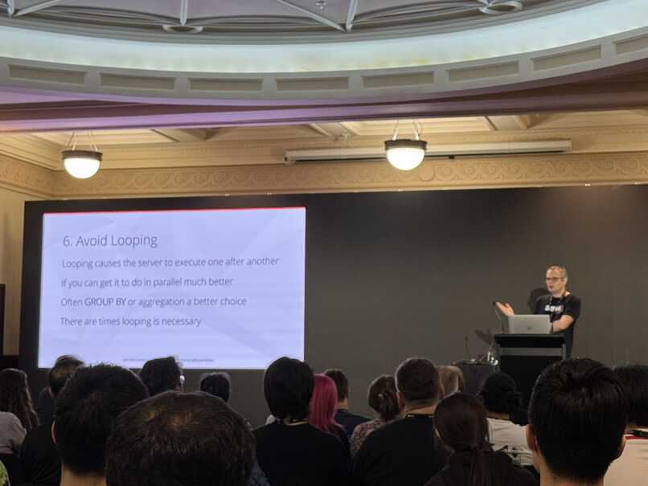

Then just a bit of time for [Swapnil Ogale](https://www.linkedin.com/in/swapnilogale/) to deliver "The Lost Art of good README documentation". Some nice tips and an encouragement to spend that time to make sure READMEs are useful.

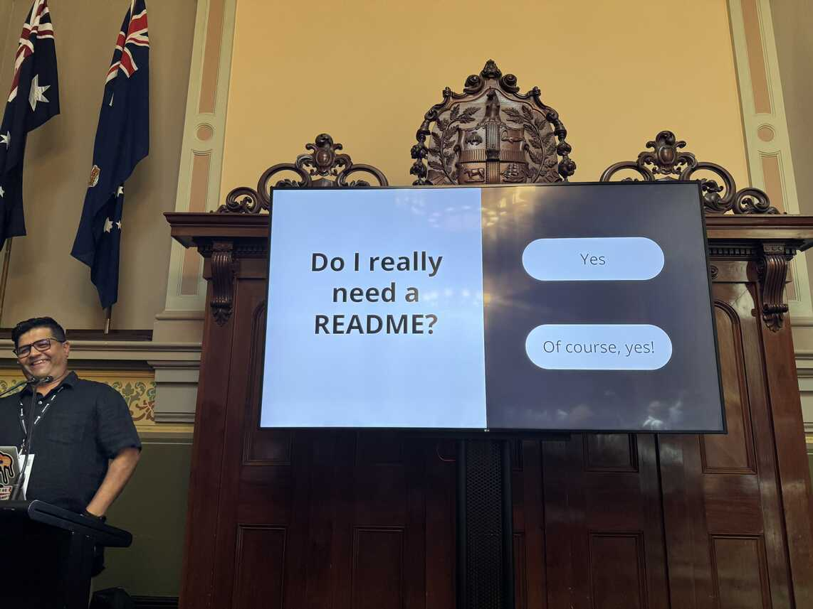

Over the lunch break I took the opportunity to check out the community room. As well as sponsor desks they'd allocated some space for a few groups to promote themselves.

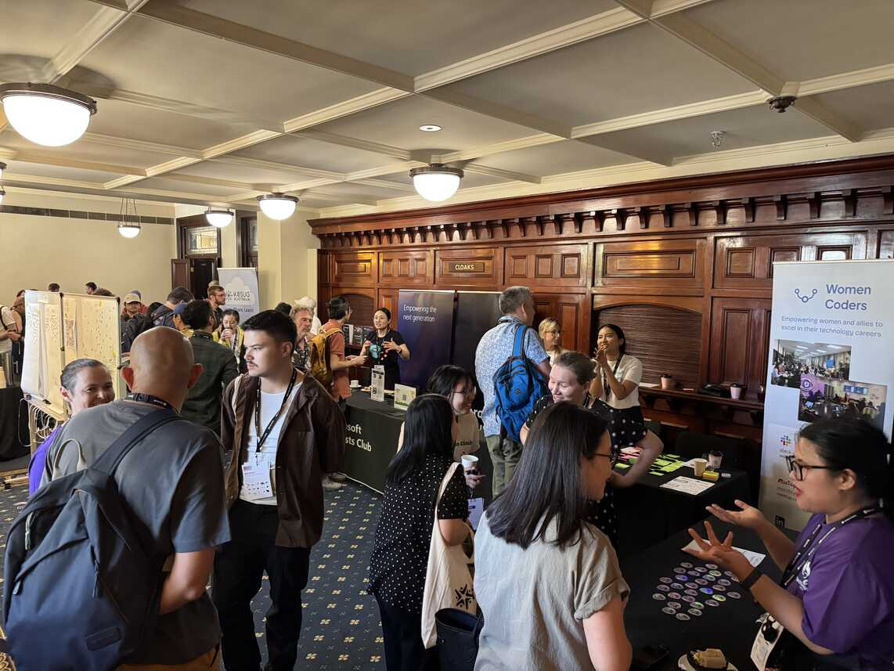

After the lunch break, I saw [Lachlan Barclay](https://www.linkedin.com/in/lachlanb/) deliver a fast-paced talk on "Performance, Profiling and Optimisation". It was great to catch up with Lachlan again.

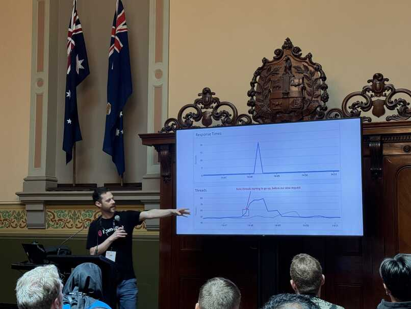

Then staying in the same room for [Michael Crook](https://www.linkedin.com/in/falconmick/) with "Unlocking Hidden Efficiency: Seamless Solutions with TDD You Didn't Know You Needed". I'm guessing Michael is new to presenting, but the content he covered was very interesting and left me with some homework to follow up on (in addition to learning about [https://sli.dev/](https://sli.dev/) which he used to create really nice slides with animated code samples)

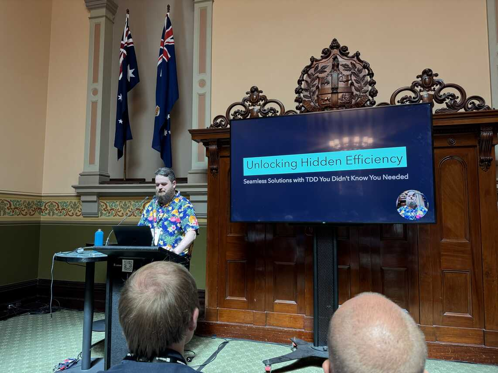

Time for afternoon tea, then [Kirsty McDonald](https://www.linkedin.com/in/kirstymcdonald/) with "Dungeons and...Developers? Building skills in tech teams with table top role playing games". I really liked the idea of using role-playing games to effectively fire-drill scenarios (but with made up characters). This was a fun talk and a great last regular session of the day.

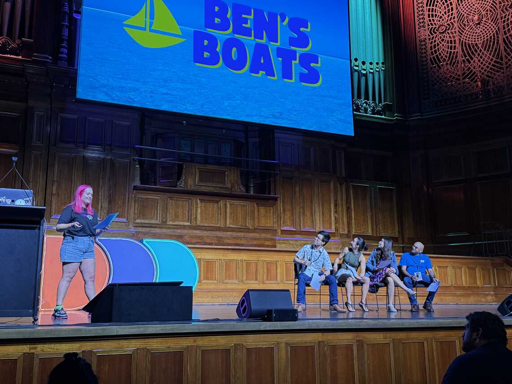

The locknote was [Aaron Powell](https://www.aaron-powell.com/), with a trip down memory lane of how we developed web sites 20 years ago, back in 2005. It brought back a lot of memories for me. Though I was talking to a new graduate at the after party later and she didn't really get a lot of the things people were laughing at.

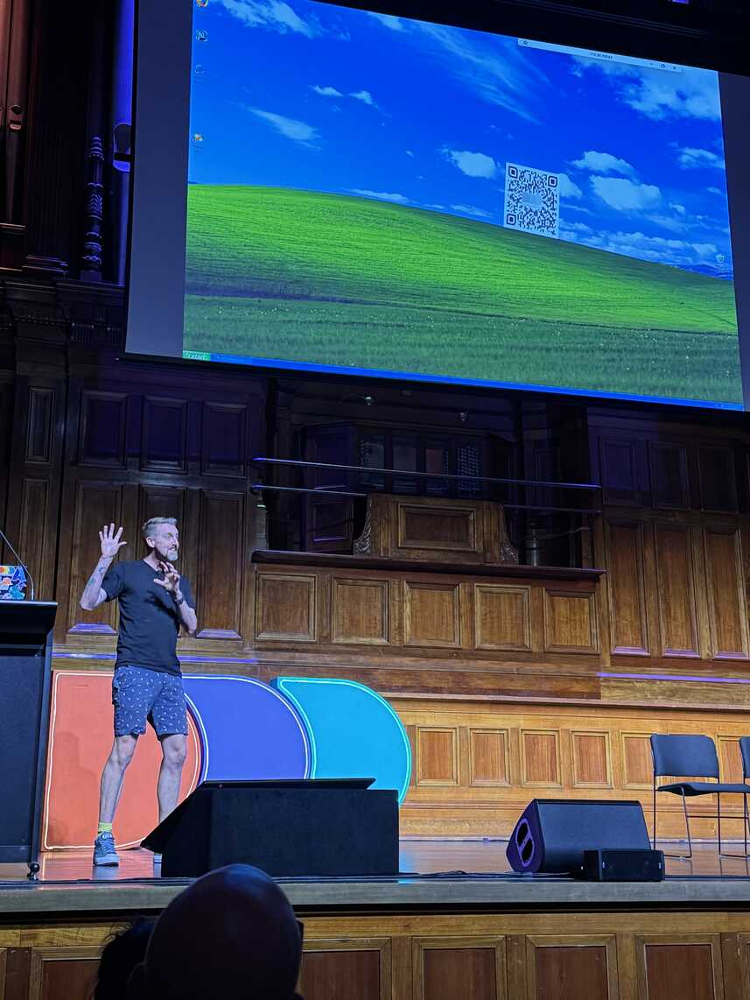

It was then time to wrap up the conference with [Bron Thulke](https://blog.angelwebdesigns.com.au/), [Lars Klint](https://www.linkedin.com/in/lklint) (the man of many colourful suits) and the team of volunteers who made the day run smoothly.

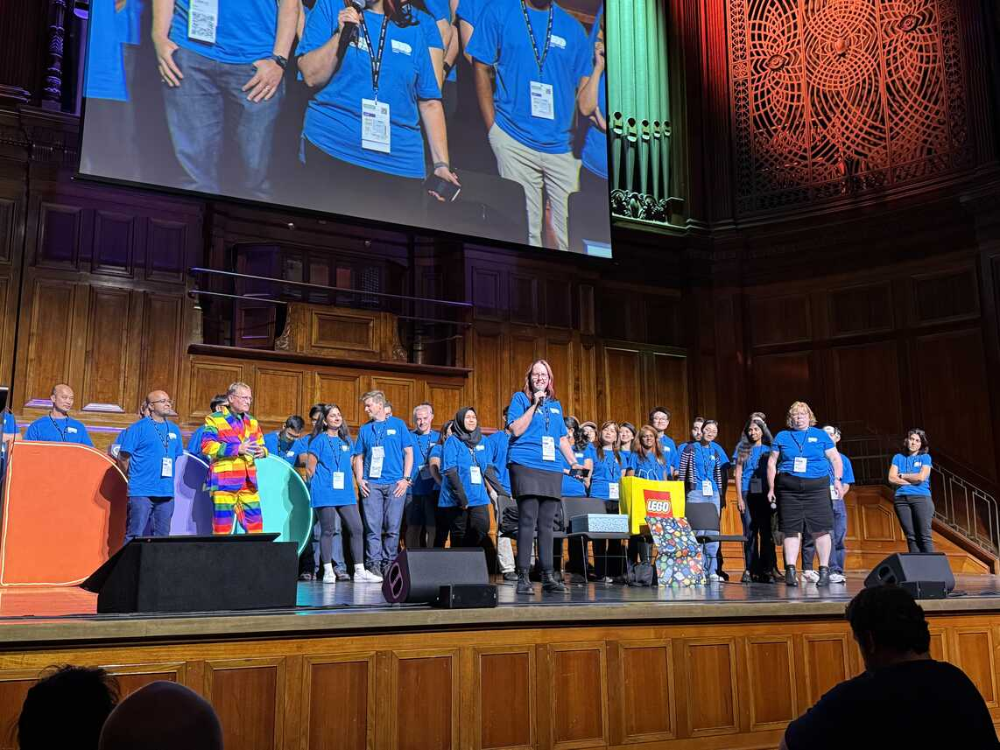

With the conference done it was off to the after-party for a few hours to catch up with everyone over a lemon squash (well I had lemon squash - not sure what everyone else was drinking!).

There's definitely some logistical challenges that Melbourne has with running such a large event compared to what we do in Adelaide. It's also interesting to see first hand how DDD runs in a commercial conference venue.

Well done DDD Melbourne, you put on a great day. As someone who has a good idea what goes into doing that, I really appreciate all you did (both seen and unseen).
