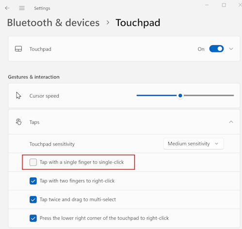
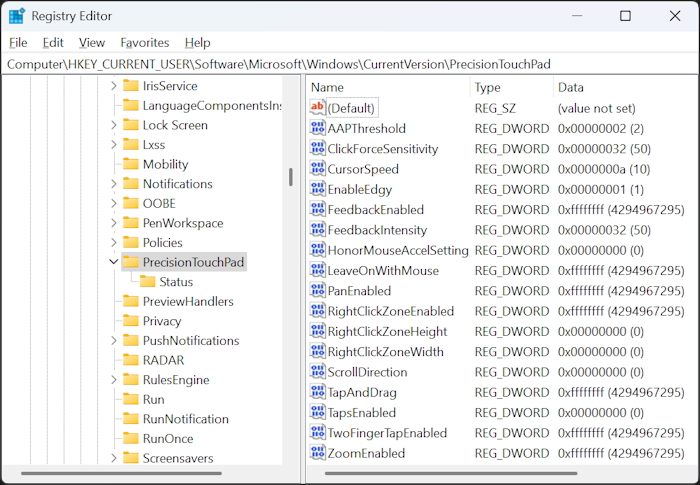
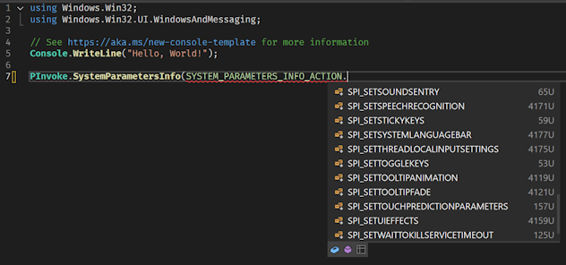
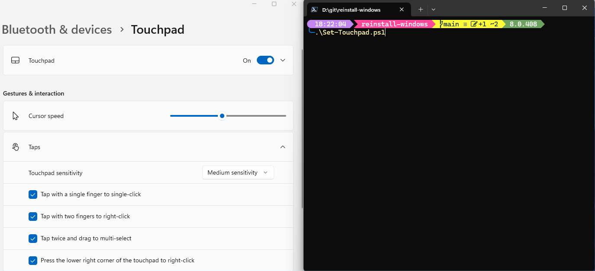

Now that I've got [a reliable process for reinstalling Windows](/2025/04/reinstalling-laptop.html), I do have a list of things that I'd like to automate to get it configured "just right". As such, I've created a new repository on GitHub and [added issues to track each one of these](https://github.com/flcdrg/reinstall-windows/issues). While my [Boxstarter scripts](https://gist.github.com/flcdrg/87802af4c92527eb8a30) will remain for now as GitHub Gists, I think it's going to be easier to manage all of these things together in the one [Git repository](https://github.com/flcdrg/reinstall-windows).

One customisation I like to make to Windows is to disable the 'Tap with a single finger to single-click' for the touchpad. I find I'm less likely to accidentally click on something when I was just tapping the touch pad to move the cursor if I turn this off.



I found some [online articles](https://learn.microsoft.com/answers/questions/1258054/how-to-turn-off-touch-gestures-in-windows-10-11-%28d?WT.mc_id=DOP-MVP-5001655) that suggested this was managed by the Registry setting `HKEY_CURRENT_USER\Software\Microsoft\Windows\CurrentVersion\PrecisionTouchPad`. Experimenting with this seems to be partly true. I can see the Registry value `TapsEnabled` is updated when I enable or disable the checkbox in Windows Settings. But the reverse did not seem to be true - if I modified the Registry key, Windows Settings doesn't change, nor does the touchpad behaviour.



Further searching lead me to the [Tuning Guidelines](https://learn.microsoft.com/windows-hardware/design/component-guidelines/touchpad-tuning-guidelines?WT.mc_id=DOP-MVP-5001655) page of the Windows Hardware Precision Touchpad Implementation Guide. I'm no hardware manufacturer, but this does document the [`TapsEnabled`](https://learn.microsoft.com/en-us/windows-hardware/design/component-guidelines/touchpad-tuning-guidelines?WT.mc_id=DOP-MVP-5001655#tap-with-a-single-finger-to-single-click) setting. Interestinly, down the bottom of that page it does also mention:

> As of Windows 11, build 26027, the user's touchpad settings can be queried and modified dynamically via the SystemParametersInfo API

I'm running Windows 11 24H2, which is build 26100, so that ['SystemParametersInfo'](https://learn.microsoft.com/windows/win32/api/winuser/nf-winuser-systemparametersinfoa?WT.mc_id=DOP-MVP-5001655) API should be available to me. Let's see if calling that does the trick.

My C/C++ is pretty rusty, whereas I'm quite at home in C# or PowerShell. My preference would be to use [.NET P/Invoke](https://learn.microsoft.com/dotnet/standard/native-interop/pinvoke?WT.mc_id=DOP-MVP-5001655) to call the Windows API.

As I've learned from previous times using P/Invoke, The trick to getting it working properly is to make sure you have the method signature(s) and data structures correct.

While my final goal is to call this from a PowerShell script, prototyping in a simple .NET console application should allow me to quickly test my definitions, plus get C# syntax highlighting and code completion within my IDE.

Let's try and find an existing definition of `SystemParametersInfo`. I searched for ".NET PInvoke" and noticed <https://github.com/dotnet/pinvoke>, but that repository is archived and you are instead pointed to <https://github.com/microsoft/CsWin32>. This project provides a .NET source generator that will create Win32 P/Invoke methods for you, based off of the latest metadata from the Windows team. That sounds perfect!

As per [the documentation](https://microsoft.github.io/CsWin32/docs/getting-started.html), I added a package reference

```bash
dotnet add package Microsoft.Windows.CsWin32
```

Then created a `NativeMethods.txt` file and added `SystemParametersInfo` to it.

I then edited `Program.cs` and tried to use my new method:



Except `SPI_GETTOUCHPADPARAMETERS` isn't available!

The documentation suggested you can get newer metadata for the source generator to use by adding a reference to the latest prerelease `Microsoft.Windows.SDK.Win32Metadata` package. I tried that, but still no joy. I've [raised an issue](https://github.com/microsoft/win32metadata/issues/2079) in the [microsoft/win32metadata](https://github.com/microsoft/win32metadata) repo, but for now it looks like I'll need to hand-roll a few of the types myself.

The docs for SPI_GETTOUCHPADPARAMETERS say the following:

- The `pvParam` parameter must point to a `TOUCHPAD_PARAMETERS` structure.
- The `uiParam` parameter must specify the size of the structure.
- The value of the `versionNumber` field in the `TOUCHPAD_PARAMETERS` structure must be set to the appropriate value for the version of the structure being used.

The [TOUCHPAD_PARAMETERS structure](https://learn.microsoft.com/windows/win32/api/winuser/ns-winuser-touchpad_parameters?WT.mc_id=DOP-MVP-5001655) is documented using C++. I asked GitHub Copilot if it could translate that into equivalent C# for me. It came up with this:

```csharp
// DO NOT USE THIS - IT IS INCORRECT!!
[StructLayout(LayoutKind.Sequential)]
public struct TOUCHPAD_PARAMETERS
{
    public uint VersionNumber;
    public uint MaxSupportedContacts;
    public LEGACY_TOUCHPAD_FEATURES LegacyTouchpadFeatures;

    // Bit fields are represented as individual boolean fields in C#
    public bool TouchpadPresent;
    public bool LegacyTouchpadPresent;
    public bool ExternalMousePresent;
    public bool TouchpadEnabled;
    public bool TouchpadActive;
    public bool FeedbackSupported;
    public bool ClickForceSupported;

    [MarshalAs(UnmanagedType.ByValArray, SizeConst = 25)]
    public bool[] Reserved1;

    public bool AllowActiveWhenMousePresent;
    public bool FeedbackEnabled;
    public bool TapEnabled;
    public bool TapAndDragEnabled;
    public bool TwoFingerTapEnabled;
    public bool RightClickZoneEnabled;
    public bool MouseAccelSettingHonored;
    public bool PanEnabled;
    public bool ZoomEnabled;
    public bool ScrollDirectionReversed;

    [MarshalAs(UnmanagedType.ByValArray, SizeConst = 22)]
    public bool[] Reserved2;

    public TOUCHPAD_SENSITIVITY_LEVEL SensitivityLevel;
    public uint CursorSpeed;
    public uint FeedbackIntensity;
    public uint ClickForceSensitivity;
    public uint RightClickZoneWidth;
    public uint RightClickZoneHeight;
}
```

And likewise for the two enums [LEGACY_TOUCHPAD_FEATURES enumeration](https://learn.microsoft.com/en-us/windows/win32/api/winuser/ne-winuser-legacy_touchpad_features?WT.mc_id=DOP-MVP-5001655) and [TOUCHPAD_SENSITIVITY_LEVEL enumeration](https://learn.microsoft.com/windows/win32/api/winuser/ne-winuser-touchpad_sensitivity_level?WT.mc_id=DOP-MVP-5001655).

One thing you need to do is set the `VersionNumber` property to `TOUCHPAD_PARAMETERS_LATEST_VERSION`. Except I searched to find out what the value of that is, and no results. I ended up resorting to installing the Windows 11 SDK so I could locate WinUser.h and then I found this:

```c
#define TOUCHPAD_PARAMETERS_LATEST_VERSION 1
#define TOUCHPAD_PARAMETERS_VERSION_1 1
```

But then trying to call SystemParametersInfo was not working. That lead me down a bit of a rabbit hole to finally conclude that something is still wrong with the mapping in `TOUCHPAD_PARAMETERS`. The original structure in C++ is this:

```c
typedef struct TOUCHPAD_PARAMETERS {
  UINT                       versionNumber;
  UINT                       maxSupportedContacts;
  LEGACY_TOUCHPAD_FEATURES   legacyTouchpadFeatures;
  BOOL                       touchpadPresent : 1;
  BOOL                       legacyTouchpadPresent : 1;
  BOOL                       externalMousePresent : 1;
  BOOL                       touchpadEnabled : 1;
  BOOL                       touchpadActive : 1;
  BOOL                       feedbackSupported : 1;
  BOOL                       clickForceSupported : 1;
  BOOL                       Reserved1 : 25;
  BOOL                       allowActiveWhenMousePresent : 1;
  BOOL                       feedbackEnabled : 1;
  BOOL                       tapEnabled : 1;
  BOOL                       tapAndDragEnabled : 1;
  BOOL                       twoFingerTapEnabled : 1;
  BOOL                       rightClickZoneEnabled : 1;
  BOOL                       mouseAccelSettingHonored : 1;
  BOOL                       panEnabled : 1;
  BOOL                       zoomEnabled : 1;
  BOOL                       scrollDirectionReversed : 1;
  BOOL                       Reserved2 : 22;
  TOUCHPAD_SENSITIVITY_LEVEL sensitivityLevel;
  UINT                       cursorSpeed;
  UINT                       feedbackIntensity;
  UINT                       clickForceSensitivity;
  UINT                       rightClickZoneWidth;
  UINT                       rightClickZoneHeight;
} TOUCHPAD_PARAMETERS, *PTOUCH_PAD_PARAMETERS, TOUCHPAD_PARAMETERS_V1, *PTOUCHPAD_PARAMETERS_V1;
```

Notice all those numbers after many of the fields? Those indicate it is a [C bit field](https://learn.microsoft.com/en-us/cpp/c-language/c-bit-fields?view=msvc-170&WT.mc_id=DOP-MVP-5001655). And guess what feature [C# doesn't currently support](https://github.com/dotnet/csharplang/discussions/465)?

In that discussion though [there is a suggestion](https://github.com/dotnet/csharplang/discussions/465#discussioncomment-8399377) that you can use [`BitVector32`](https://learn.microsoft.com/dotnet/api/system.collections.specialized.bitvector32?view=net-9.0&WT.mc_id=DOP-MVP-5001655) or [`BitArray`](https://learn.microsoft.com/dotnet/api/system.collections.bitarray?view=net-9.0&WT.mc_id=DOP-MVP-5001655) as a workaround. For usability, we can add properties in to expose access to the individual bits in the `BitVector32` field. Also note that the values passed in via the `[]` is a bitmask, not an array index. (Yes, that tricked me the first time too!)

```csharp
[StructLayout(LayoutKind.Sequential)]
public struct TOUCHPAD_PARAMETERS
{
    public uint VersionNumber;
    public uint MaxSupportedContacts;
    public LEGACY_TOUCHPAD_FEATURES LegacyTouchpadFeatures;

    private BitVector32 First;

    public bool TouchpadPresent
    {
        get => First[1];
        set => First[1] = value;
    }

    public bool LegacyTouchpadPresent
    {
        get => First[2];
        set => First[2] = value;
    }
```

With that done, we can now call `SystemParametersInfo` like this:

```csharp
const uint SPI_GETTOUCHPADPARAMETERS = 0x00AE;

unsafe
{
    TOUCHPAD_PARAMETERS param;
    param.VersionNumber = 1;

    var size = (uint)Marshal.SizeOf<TOUCHPAD_PARAMETERS>();
    var result = PInvoke.SystemParametersInfo((SYSTEM_PARAMETERS_INFO_ACTION)SPI_GETTOUCHPADPARAMETERS,
        size, &param, 0);
```

And it works! Now curiously, the Windows Settings page doesn't update in real time, but if you go to a different page and then navigate back to the Touchpad page, the setting has updated!

We can refactor the code slightly to put it into a helper static class, so it's easier to call from PowerShell. To make this easier I created a second Console application, but this time I didn't add any source generators, so I would be forced to ensure that all required code was available You can [view the source code here](https://github.com/flcdrg/reinstall-windows/blob/main/StandaloneApp/Program.cs).

I could then copy the C# into a PowerShell script and use the `Add-Type` command to include it in the current PowerShell session. Note the use of `-CompilerOptions "/unsafe"`, which we need to specify as we're using the `unsafe` keyword in our C# code.

```powershell
$source=@'
using System;
using System.Collections.Specialized;
using System.Runtime.InteropServices;
using System.Runtime.Versioning;

public static class SystemParametersInfoHelper
{
    [DllImport("USER32.dll", ExactSpelling = true, EntryPoint = "SystemParametersInfoW", SetLastError = true), DefaultDllImportSearchPaths(DllImportSearchPath.System32)]
    [SupportedOSPlatform("windows5.0")]
    internal static extern unsafe bool SystemParametersInfo(uint uiAction, uint uiParam, [Optional] void* pvParam, uint fWinIni);

    public static void DisableSingleTap()
    {
        const uint SPI_GETTOUCHPADPARAMETERS = 0x00AE;
        const uint SPI_SETTOUCHPADPARAMETERS = 0x00AF;

        unsafe
        {
            // Use a fixed buffer to handle the managed type issue  
            TOUCHPAD_PARAMETERS param;
            param.VersionNumber = 1;

            var size = (uint)Marshal.SizeOf<TOUCHPAD_PARAMETERS>();
            var result = SystemParametersInfo(SPI_GETTOUCHPADPARAMETERS, size, &param, 0);

            if (param.TapEnabled)
            {
                param.TapEnabled = false;

                result = SystemParametersInfo(SPI_SETTOUCHPADPARAMETERS, size, &param, 3);
            }
        }
    }
}

[StructLayout(LayoutKind.Sequential)]
public struct TOUCHPAD_PARAMETERS
{
    ...
'@

Add-Type -TypeDefinition $source -Language CSharp -PassThru -CompilerOptions "/unsafe" | Out-Null
[SystemParametersInfoHelper]::DisableSingleTap()
```

The complete version of the script is [available here](https://github.com/flcdrg/reinstall-windows/blob/main/Set-Touchpad.ps1).



That's one problem solved. Just a few more to go!
